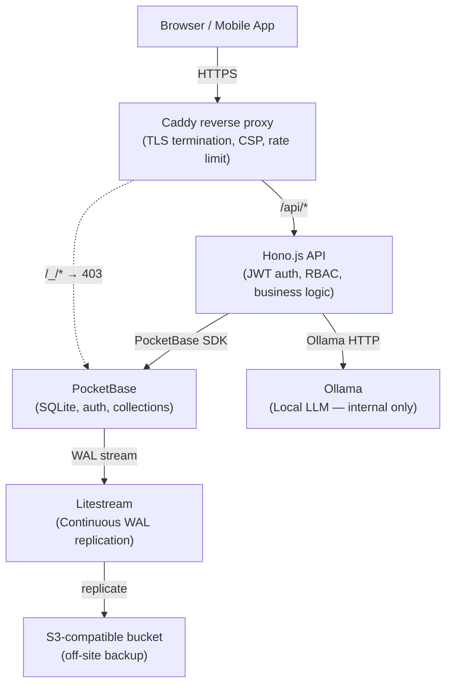

# BMI UMS — Architecture

## Component overview

## Network security model

All services except Caddy use `expose:` not `ports:`. PocketBase and Ollama are not reachable
from outside the Docker bridge network. Ollama is further locked to `OLLAMA_ORIGINS=http://api:3001`.

## Scalability ceiling

SQLite via PocketBase supports approximately 5,000 concurrent users with this architecture.
